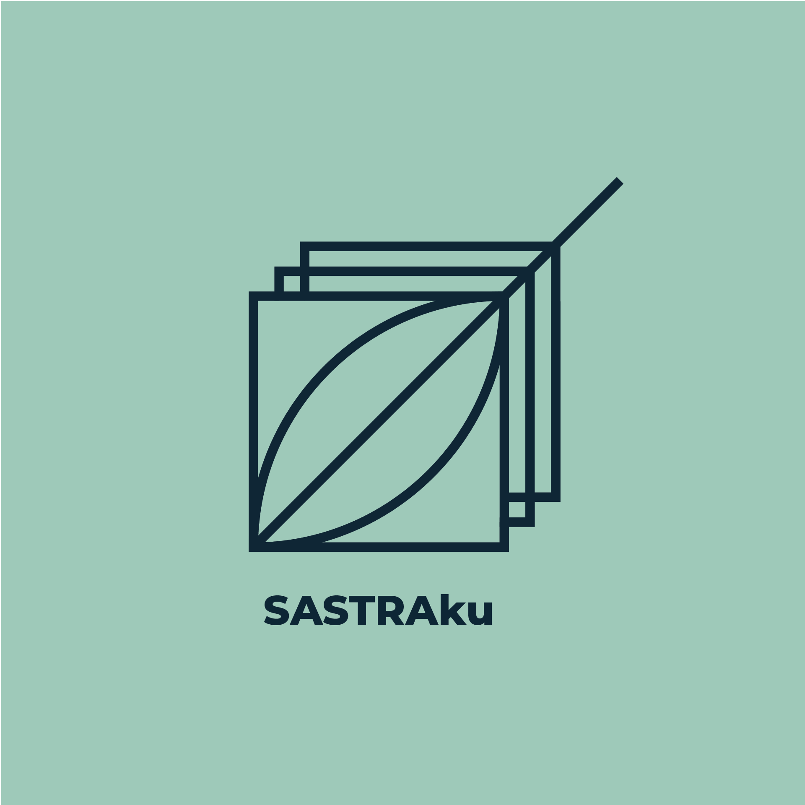

# SASTRAKU

## APLIKASI SEDANG TAHAP PENGEMBANGAN

Sastraku adalah aplikasi di mana pengguna dapat saling berbagi karya sastra seperti puisi, pantun, dan karya sastra lainnya.

## Tech Stack

Berikut adalah teknologi yang digunakan dalam pengembangan aplikasi ini:

### Frontend

- **Next.js**
- **Tailwind CSS**

### Backend

- **PostgreSQL**

## Kontributor

- [RIZIQ LILI ULIL ALBAB](https://github.com/AlbabRiziq)
- [NURI NAFISAH RAMADHANI](https://github.com/nurinafisah)
- [SALUH JANNATU U.](https://github.com/saluhju)
- ASYIFATUL JANNAH
